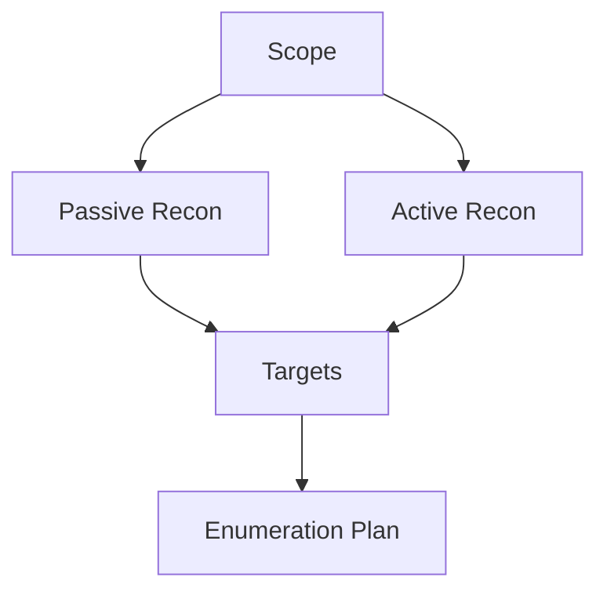

# Reconnaissance Overview

> [!info] Navigation
> [[Home]] | [[Master Table of Contents]] | [[Exam Cram Guide]] | [[Command Dashboard]] | [[Curated External Sources]] | [[Visual Diagram Index]]

## Sections in This Note
- [[#Two Types of Information Gathering|Two Types of Information Gathering]]

---

## Two Types of Information Gathering
- Passive Information Gathering
- Active Information Gathering

**Passive Information Gathering**
Involves gathering as much information as possible without actively engaging with the target.
- Identifying IP address and DNS info, domain name, domain ownership, email, social media profiles, subdomains used, web technology used, etc.

**Active Information Gathering**
Involves gathering as much information as possible by actively engaging with the target system.
- Discovering open ports on the target, internal infrastructure of the target, and enumerating information from the target system.

---

## Passive Information Gathering
	WIP

## Visual Diagram

## Related
- [[Exam Cram Guide]]
- [[Command Dashboard]]
