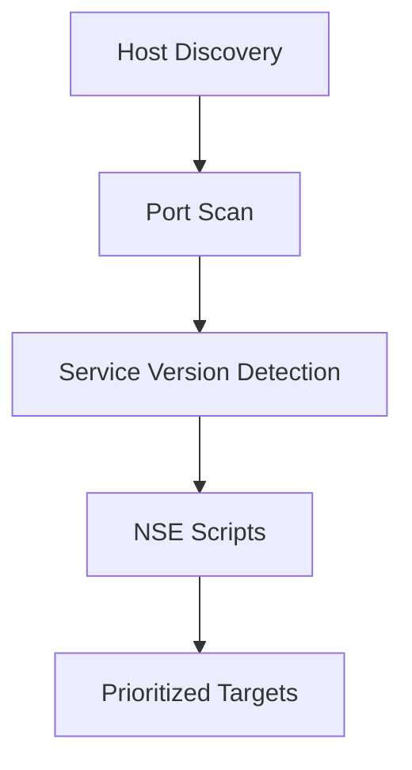

# Nmap Enumeration

> [!info] Navigation
> [[Home]] | [[Master Table of Contents]] | [[Exam Cram Guide]] | [[Command Dashboard]] | [[Curated External Sources]] | [[Visual Diagram Index]]


## Sections in This Note
- [[#Host Discovery with Nmap|Host Discovery with Nmap]]
- [[#Port Scanning with Nmap|Port Scanning with Nmap]]
- [[#SMB: Nmap Scripts|SMB: Nmap Scripts]]
- [[#MSSQL: Nmap Scripts|MSSQL: Nmap Scripts]]
- [[#Port Scanning & Enumeration with Nmap|Port Scanning & Enumeration with Nmap]]
- [[#Banner Grabbing|Banner Grabbing]]
- [[#Vulnerability Scanning with Nmap Scripts|Vulnerability Scanning with Nmap Scripts]]

---

## Host Discovery with Nmap
```
sudo nmap -sn ip/subnet
```
`netdiscover` can also be used for the same purpose.

## Port Scanning with Nmap
```
nmap ipaddress                # default scanning
nmap -Pn ipaddress            # resolve the ping problem
-p                             # specify the port number
-F                             # fast scan (frequently used ports only)
-sU                             # UDP port scan (Nmap does TCP by default)
-v                              # display results during the scanning process
-sV                             # service version detection scan
-O                              # identify the OS of the target
-sC                             # perform Nmap script scan for more info
-A                              # aggressive scan (combines -sV, -O, -sC)
-T0 -T1 -T2 -T3 -T4 -T5         # Paranoid|Sneaky|Polite|Normal|Aggressive|Insane (timing)
-oN test.txt                    # save output in txt format
-oX test.xml                    # save output in xml format
```

**Other basics:**
- Print statement: `echo (word to print)`
- Present working directory: `pwd`

---

## Assessment Methodologies: Enumeration

## SMB: Nmap Scripts
```
# Basic SMB enumeration
nmap -p445 --script smb-protocols (IPaddress)

# Security mode
nmap -p445 --script smb-security-mode (IPaddress)

# Session enumeration
nmap -p445 --script smb-enum-sessions (IPaddress)

# Pass user & pass as script arguments
nmap -p445 --script smb-enum-sessions --script-args smbusername=(username),smbpassword=(password) (IPaddress)

# SMB shares
nmap -p445 --script smb-enum-shares (IPaddress)

# User enumeration
nmap -p445 --script smb-enum-users --script-args smbusername=(username),smbpassword=(password) (IPaddress)

# Domain enumeration
nmap -p445 --script smb-enum-domains --script-args smbusername=(username),smbpassword=(password) (IPaddress)
```

## MSSQL: Nmap Scripts
```
# Discover MSSQL server information
nmap --script ms-sql-info -p 1433 (IPaddress)

# Disclose more info via NTLM
nmap -p1433 --script ms-sql-ntlm-info --script-args mssql.instance-port=1433 (IPaddress)

# Enumerate valid MSSQL user/password
nmap -p 1433 --script ms-sql-brute --script-args userdb=(location) (IPaddress)

# Identify empty user password
nmap -p1433 --script ms-sql-empty-password (IPaddress)
```

---

## Vulnerability Assessment

## Port Scanning & Enumeration with Nmap

Nmap is a free and open-source network scanner used to discover hosts on a network and scan targets for open ports. It can also enumerate services running on open ports and the operating system running on the target. We can output Nmap scan results in a format importable into MSF for vulnerability detection and exploitation.

## Banner Grabbing

Banner grabbing is an information gathering technique used to enumerate information regarding the target operating system as well as services running on open ports. The primary objective is to identify the service running on a specific port as well as its version. Techniques:
- Performing a service version detection scan with Nmap
- Connecting to the open port with Netcat
- Authenticating with the service (if supported), e.g., SSH, FTP, Telnet

```
nmap -sV -O (IPaddress)

# Banner grabbing with nmap
ls -al /usr/share/nmap/scripts/ | grep banner
nmap -sV --script=banner (IPaddress)

# Using netcat
nc (IPaddress) (port number)
```

## Vulnerability Scanning with Nmap Scripts

```
# Default directory where nmap scripts are stored
ls -al /usr/share/nmap/scripts

# List scripts for a particular service
ls -al /usr/share/nmap/scripts | grep (service name)

# List vulnerability scripts
ls -al /usr/share/nmap/scripts | grep vuln
```

## External Sources
- [Nmap Official Reference Guide](https://nmap.org/book/man.html)

## Visual Diagram


## Related
- [[Exam Cram Guide]]
- [[Command Dashboard]]

---

