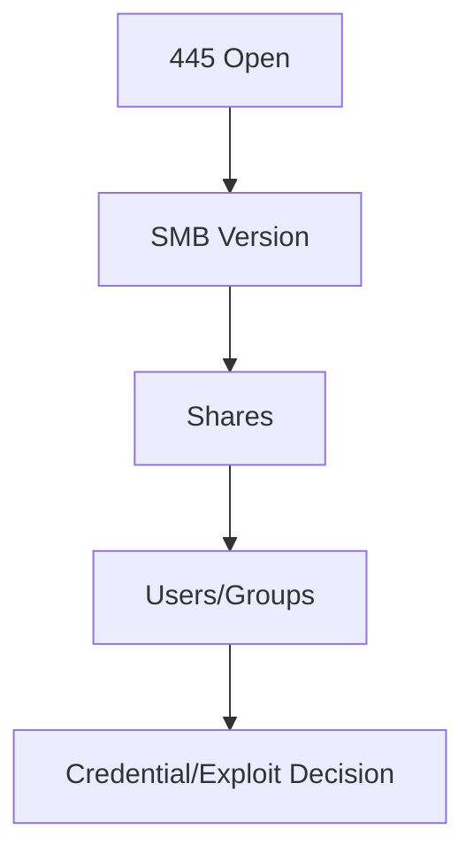

# SMB Enumeration

> [!info] Navigation
> [[Home]] | [[Master Table of Contents]] | [[Exam Cram Guide]] | [[Command Dashboard]] | [[Curated External Sources]] | [[Visual Diagram Index]]


## Sections in This Note
- [[#SMB: Windows Discover & Mount|SMB: Windows Discover & Mount]]
- [[#SMB: SMBmap|SMB: SMBmap]]
- [[#SMB: Samba|SMB: Samba]]
- [[#SMB: Samba (2)|SMB: Samba (2)]]
- [[#SMB: Samba (3)|SMB: Samba (3)]]
- [[#Samba Recon: Dictionary Attack|Samba Recon: Dictionary Attack]]
- [[#SMB Enumeration|SMB Enumeration]]
- [[#SMB Enumeration|SMB Enumeration]]

---

## SMB: Windows Discover & Mount
SMB is the Windows implementation of a file share. SMB stands for Server Message Block. SMB uses port 445 (TCP), originally ran on NetBIOS port 139. SAMBA is the Linux implementation of SMB, allowing Windows systems to access Linux shares/devices. We can use auxiliary modules to enumerate SMB version, shares, users, and perform brute-force attacks.

## SMB: SMBmap
```
# Guest user
smbmap -u guest -p "" -d . -H (IPaddress)

# Administrator
smbmap -u administrator -p smbserver_771 -d . -H (IPaddress)

# List the drives
smbmap -H (IPaddress) -u (username) -p ('password') -L

# List files in C drive
smbmap -H (IPaddress) -u (username) -p ('') -r 'C$'
```

**Create and upload a file:**
```
$ ls
$ touch backdoor
$ smbmap -H (IPaddress) -u (username) -p ('password') --upload '/root/backdoor' 'C$\backdoor'
```

**Download a file:**
```
smbmap -H (IPaddress) -u (username) -p ('password') --download 'C$\filename'
```

## SMB: Samba
```
# Default TCP port
nmap -sS (IPaddress)

# Default UDP ports
nmap -sU --top-ports 25 (IPaddress)

# Find workgroup name
nmap -sV -p445 (IPaddress)

# Find exact version & NetBIOS computer name
nmap (IPaddress) -p 445 --script smb-os-discovery
```

**Using Metasploit:**
```
msfconsole
use auxiliary/scanner/smb/smb_version
show options
set RHOSTS (IPaddress)
run
exploit
```

**Other utilities:**
```
# NetBIOS name using nmblookup
nmblookup -A (IPaddress)

# List hosts
smbclient -L (IPaddress) -N

# rpcclient
rpcclient -U "" -N (IPaddress)
getusername
```

## SMB: Samba (2)
```
# OS version using rpcclient
rpcclient -U "" -N (IPaddress)

# OS version using enum4linux
enum4linux -o (IPaddress)

# Server description using smbclient
smbclient -L (IPaddress) -N

# smb2 protocol support using Metasploit
msfconsole
use auxiliary/scanner/smb/smb2
set RHOST (IPaddress)
exploit
```

**List all users:**
```
# Using nmap
nmap --script smb-enum-users.nse -p445 (IPaddress)

# Using Metasploit
msfconsole
use auxiliary/scanner/smb/smb_enumusers
set RHOST (IPaddress)
exploit

# Using enum4linux
enum4linux -U (IPaddress)

# Using rpcclient
rpcclient -U "" -N (IPaddress)
enumdomusers
```

**Find SID of admin:**
```
rpcclient -U "" -N (IPaddress)
lookupnames admin
```

## SMB: Samba (3)
```
# List shares using nmap
nmap (IPaddress) --script smb-enum-shares -p445

# List shares using Metasploit
msfconsole
use auxiliary/scanner/smb/smb_enumshares
set RHOSTS (IPaddress)
exploit

# List shares using enum4linux
enum4linux -S (IPaddress)

# List shares using smbclient
smbclient -L (IPaddress) -N

# Find all domain groups
enum4linux -G (IPaddress)
# or
rpcclient -U "" -N (IPaddress)
enumdomgroups

# Check printing configuration
enum4linux -i (IPaddress)
```

## Samba Recon: Dictionary Attack

**Using Metasploit:**
```
msfconsole
use auxiliary/scanner/smb/smb_login
set PASS_FILE (location of the file)
set SMBUser (username)
set RHOST (IPaddress)
exploit
```

**Using Hydra:**
```
gzip -d (location)
hydra -l admin -P (location) (IPaddress) smb
```

**List available named pipes:**
```
msfconsole
use auxiliary/scanner/smb/pipe_auditor
set SMBUser admin
set SMBPass (password)
set RHOST (IPaddress)
exploit
```


## SMB Enumeration

```
nmap -sV -sC -p 445 10.0.22.85
```
```
Host script results:
| smb-security-mode:
|   account_used: guest
|   authentication_level: user
|   challenge_response: supported
|_  message_signing: disabled (dangerous, but default)
| nbstat: NetBIOS name: VAGRANT-2008R2, NetBIOS user: <unknown>, NetBIOS MAC: 06:ae:9f:20:0f:3a (unknown)
| smb2-security-mode:
|   2.1:
|_    Message signing enabled but not required
| smb-os-discovery:
|   OS: Windows Server 2008 R2 Standard 7601 Service Pack 1 (Windows Server 2008 R2 Standard 6.1)
|   OS CPE: cpe:/o:microsoft:windows_server_2008::sp1
|   Computer name: vagrant-2008R2
|   NetBIOS computer name: VAGRANT-2008R2\x00
|   Workgroup: WORKGROUP\x00
|_  System time: 2022-01-23T13:10:27-08:00
| smb2-time:
|   date: 2022-01-23T21:10:27
|_  start_date: 2022-01-23T20:55:20
```

**Using a Metasploit module to obtain the exact SMB version:**
```
msfconsole
use auxiliary/scanner/smb/smb_version
set RHOSTS 10.0.22.85
run
```
```
msf6 auxiliary(scanner/smb/smb_version) > run

[*] 10.0.22.85:445  - SMB Detected (versions:1, 2) (preferred dialect:SMB 2.1) (signatures:optional) (uptime:23m 42s) (guid:{6c52a4f5-98fb-49a5-89c7-1440654d62e7}) (authentication domain:VAGRANT-2008R2)
[+] 10.0.22.85:445  - Host is running Windows 2008 R2 Standard SP1 (build:7601) (name:VAGRANT-2008R2) (workgroup:WORKGROUP)
[*] 10.0.22.85:      - Scanned 1 of 1 hosts (100% complete)
[*] Auxiliary module execution completed
msf6 auxiliary(scanner/smb/smb_version) > hosts
```

```
exit
```

## External Sources
- [Microsoft SMB Protocol Overview](https://learn.microsoft.com/en-us/windows/win32/fileio/microsoft-smb-protocol-and-cifs-protocol-overview)

## Visual Diagram


## Related
- [[Exam Cram Guide]]
- [[Command Dashboard]]
