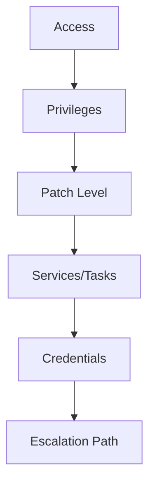

# Windows Privilege Escalation

> [!info] Navigation
> [[Home]] | [[Master Table of Contents]] | [[Exam Cram Guide]] | [[Command Dashboard]] | [[Curated External Sources]] | [[Visual Diagram Index]]


## Sections in This Note
- [[#Windows Access Tokens|Windows Access Tokens]]
- [[#Alternate Data Streams|Alternate Data Streams]]

---

## Windows Access Tokens

Windows access tokens are a core element of the authentication process on Windows and are created and managed by the Local Security Authority Subsystem Service (LSASS).

**Privileges required for a successful impersonation attack:**
- **SeAssignPrimaryToken:** Allows a user to impersonate tokens.
- **SeCreateToken:** Allows a user to create an arbitrary token with administrative privileges.
- **SeImpersonatePrivilege:** Allows a user to create a process under the security context of another user, typically with administrative privileges.

We can use the incognito module to display a list of available tokens that we can impersonate.

## Windows File System Vulnerabilities

## Alternate Data Streams
Alternate Data Streams (ADS) is an NTFS (New Technology File System) file attribute, designed to provide compatibility with the macOS HFS (Hierarchical File System).

## Windows Credential Dumping

## Visual Diagram


## Related
- [[Exam Cram Guide]]
- [[Command Dashboard]]

---
## Migrated from Unsorted Notes — Windows Privilege Escalation

### Windows Privilege Escalation

Privilege escalation is the process of exploiting vulnerabilities or misconfigurations in systems to elevate privileges from one user to another, typically to administrative or root access. It's a vital element of the attack life cycle and a major determinant in the overall success of a penetration test.

After gaining an initial foothold, you'll need to elevate your privileges to perform tasks requiring administrative privileges.

---
## Migrated from Unsorted Notes — Windows Kernel Exploit

### Windows Kernel Exploit

A kernel is a computer program that is the core of an operating system and has complete control over every resource and hardware on a system. It acts as a translation layer between hardware and software and facilitates communication between the two.

Windows NT is the kernel that comes pre-packaged with all versions of Microsoft Windows. It has two main modes of operation:
- **User mode:** Programs and services running in user mode have limited access to system resources and functionality.
- **Kernel mode:** Kernel mode has unrestricted access to system resources and functionality, including managing devices and system memory.

This process differs based on the version of Windows targeted and the kernel exploit used.

---
## Migrated from Unsorted Notes — Tools

### Tools

**Windows-Exploit-Suggester:** Compares a target's patch level against the Microsoft vulnerability database to detect potential missing patches. Notifies the user of public exploits and Metasploit modules available for missing bulletins.
https://github.com/AonCyberLabs/Windows-Exploit-Suggester

**Windows-Kernel-Exploits:** Collection of Windows kernel exploits sorted by CVE.
https://github.com/SecWiki/windows-kernel-exploits

**Privilege escalation process (after getting a meterpreter session):**
```
shell
systeminfo
# copy the system info and save as .txt file
```

**Using Windows Exploit Suggester:**
```
cd windows-enum/Windows-Exploit-Suggester
ls
./windows-exploit-suggester.py --update
./windows-exploit-suggester.py --database (downloaded database name) --systeminfo ~/desktop/(systeminfo txt file)
```

Then find the suggested kernel exploit on https://github.com/SecWiki/windows-kernel-exploits, download it, and upload it to the temp folder.
