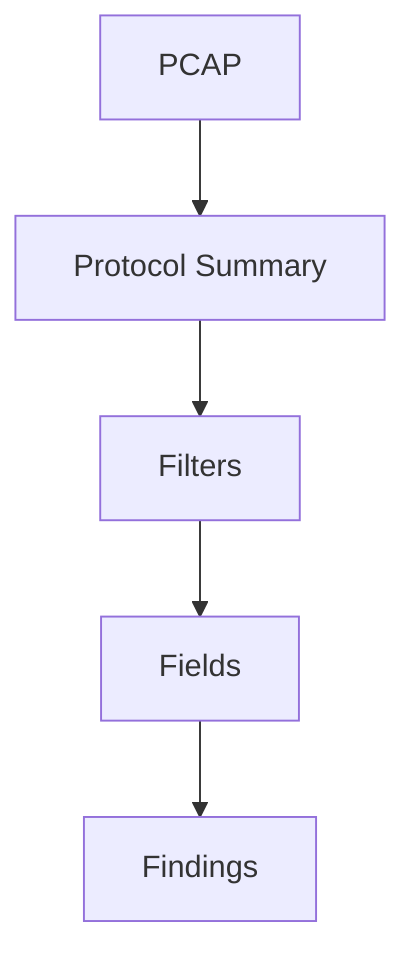

# Packet Analysis with Tshark

> [!info] Navigation
> [[Home]] | [[Master Table of Contents]] | [[Exam Cram Guide]] | [[Command Dashboard]] | [[Curated External Sources]] | [[Visual Diagram Index]]


## Sections in This Note
- [[#Tshark|Tshark]]
- [[#Filtering Basics: HTTP|Filtering Basics: HTTP]]

---

## Tshark

Tshark is a command line tool created by the Wireshark team, sharing the same parsing engine as Wireshark, but with the "from command line" advantage — ideal for batch analysis, offline processing, and routine automation of traffic analysis tasks.

```
# Version of Tshark
tshark -v

# Supported network interfaces for monitoring
tshark -D

# Sniff on eth0
tshark -i eth0

# Read a file and display packet list
tshark -r HTTP_traffic.pcap

# Total number of packets in the file
tshark -r HTTP_traffic.pcap | wc -l

# List of protocols
tshark -r HTTP_traffic.pcap -z io,phs -q
```

## Filtering Basics: HTTP

HTTP is one of the most common protocols on the Internet. Unfortunately, HTTP is plain text, so an attacker with network access can sniff and read packet data effortlessly.

```
# Show only HTTP traffic
tshark -Y 'http' -r HTTP_traffic.pcap

# Show only IP packets from 192.168.252.128 to 52.32.74.91
tshark -r HTTP_traffic.pcap -Y 'ip.src==192.168.252.128 && ip.dst==52.32.74.91'

# Show only GET request packets
tshark -r HTTP_traffic.pcap -Y 'http.request.method==GET'

# Print source IP and URL for all GET requests
tshark -r HTTP_traffic.pcap -Y "http.request.method==GET" -Tfields -e frame.time -e ip.src -e http.request.full_uri

# HTTP packets containing "password" string
tshark -r HTTP_traffic.pcap -Y "http contains password"
```

## External Sources
- [Wireshark Manual Pages / TShark](https://www.wireshark.org/docs/man-pages/)

## Visual Diagram


## Related
- [[Exam Cram Guide]]
- [[Command Dashboard]]
