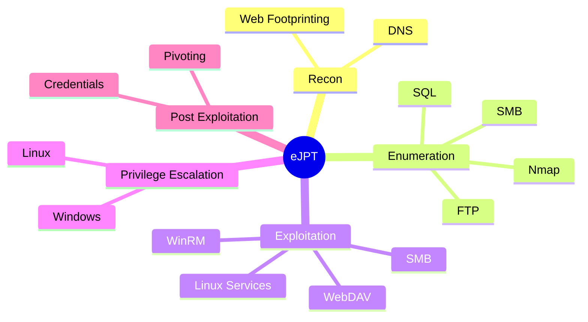

# Exam Cram Guide

## Review Path
1. [[Reconnaissance Overview]]
2. [[Nmap Enumeration]]
3. [[SMB Enumeration]]
4. [[Web Enumeration]]
5. [[Exploitation Methodology]]
6. [[Windows Privilege Escalation]]
7. [[Linux Privilege Escalation]]
8. [[Post Exploitation Overview]]
9. [[Pivoting]]
10. [[Command Dashboard]]

## Visual Diagram — eJPT Study Map

